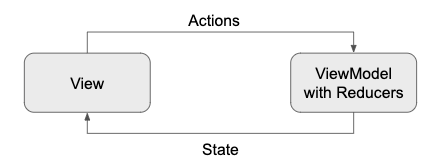
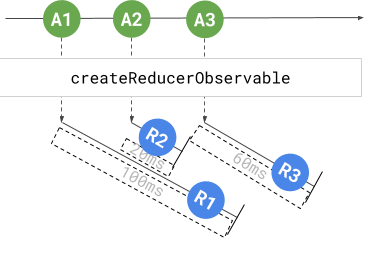
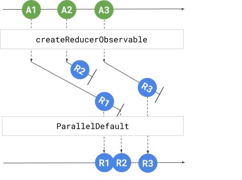
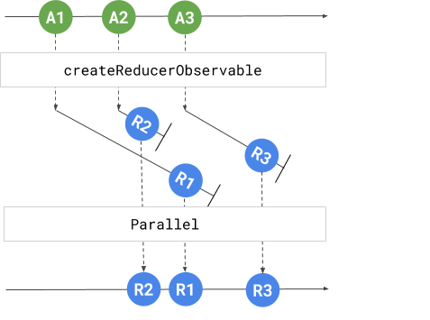
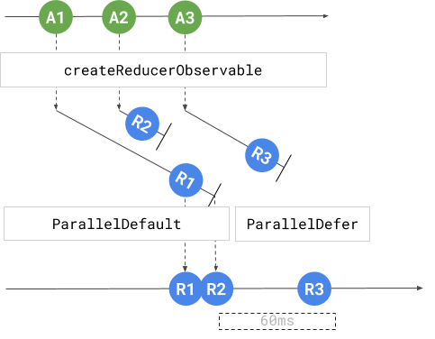
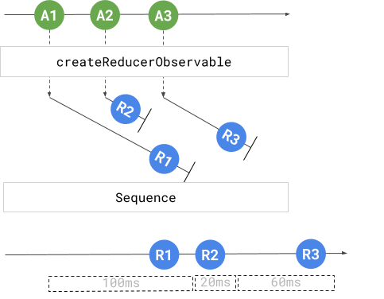
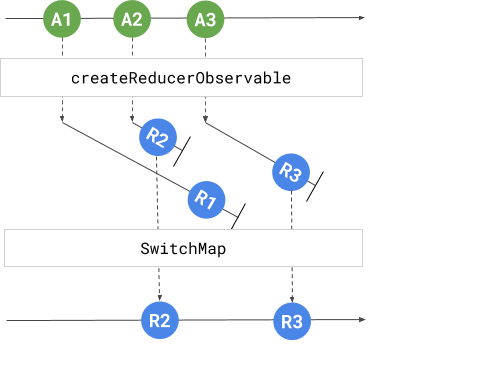

# RxViewModel for Android - Making Reactive MVVM easier

The concept is simple, it has 4 major parts

 - **State**. Single source of truth. It is a **data class** that holds **all the data**.
 - **Action**. The things that we want the ViewModel to do. Usually, action can be a **sealed class** (recommended) or an enum.
 - **ViewModel**. It takes actions as inputs and produce state observable/LiveData as outputs.
 - **View**. It is a class that renders data from the observable/LiveData in ViewModel. And creates actions for ViewModel to execute.




## Use the Library
Add the library below to your app's build.gradle.  
```
	implementation 'semap.rx:rxviewmodel:1.1.2'
```

##  Example of How to Use It
Below are the steps to use it. We take the login as an example. User needs to input username (min length 5) and password (min length 3) to login.
### State
Since we allow user to input username and password. So we can define a data class below.
```
data class LoginState(  
        val username: String = "",  
        val password: String = "")
```
### Actions
Actions are the commands we want ViewModel to execute. So we have 3 actions.
```
sealed class LoginAction {  
    data class SetUsername(val username: String): LoginAction()  
    data class SetPassword(val password: String): LoginAction()  
    object Login: LoginAction()  
}
```
### ViewModel
A ViewModel class extends RxViewModel. It needs to override 2 methods.
```
class MyViewModel: RxViewModel<LoginAction, LoginState>() {  
    override fun createInitialState() = LoginState()  
  
    override fun createReducerObservable(action: LoginAction): Observable<Reducer<LoginState>>? {  
        return null  
    }  
}
```

 - **createInitialState**. A function that creates initial state
 - **createReducerObservable**. A function that creates the next state based on the current state and the given action. If it returns null, it means that action does not change state.

The return type of **createReducerObservable** is **Observable<Reducer<LoginState>>?**. A reducer is nothing but a function that currentState as the input and return the outputState.
```
typealias Reducer<S> = (S) -> S
```

So for action SetUsername, the Reducer is 
```
{ state -> state.copy(username = XXX) }
```
Below is the final version of function **createReducerObservable**
```
override fun createReducerObservable(action: LoginAction): Observable<Reducer<LoginState>>? {  
    return when (action) {  
    
        is SetUsername -> 
	        Observable.just { state -> state.copy(username = action.username) }  
        
        is SetPassword -> 
	        Observable.just { state -> state.copy(password = action.password) }  
        
        Login -> Observable.fromCallable { currentState }
	        .flatMap { loginService.loginToServer(it.username, it.password)
	        .delay(3, TimeUnit.SECONDS) // delay 3 secs to make it fell like a real API call
	        .map { _ -> { it } } 
	}  
}
```
You can see that the Reducer for Login action is `{ it } `. It means that action does not change state.

*Optional*: override **showSpinner** function.
If the viewModel want to provide a observable/LiveData for when to render spinner. we can override it.
```
override fun showSpinner(action: LoginAction): Boolean {  
    return when (action) {  
        Login -> true  
        else -> false  
    }  
}
```

After override the functions above, your view model will have 6 observables automatically.

 - **stateObservable**
 - **actionOnCompleteObservable**
 - **actionOnNextObservable**
 - **isLoadingObservable**
 - **errorObservable**
 - **actionErrorObservable**

 And your can further create your own observables from observables above. For example, in the view we need to know when to enable/disable the signIn button. We can create one in the viewModel 
```
val isFormValid  
	get() = stateObservable 
		.map { it.username.length > 4 && it.password.length > 2 }
		.distinctUntilChanged()              
		.asLiveData()
``` 
and more
```
val error
	get() = errorObservable
		.asLiveData()
	
val signInSuccessfully 
	get() = actionOnCompleteObservable(Login::class.java)  
        .asLiveData()
```
RxViewModel provides a function  `asLiveData` in the ViewModel for you to convert observable to LiveData, it will also automatically dispose the observable for you. It also handles errors (errors will be emitted in the errorObservable and actionErrorObservable)

### View - Part 1 - Ask ViewModel to Execute Actions
In the view, when user inputs username, we ask ViewModel to execute and action called **SetUsername**.  Similarly, we do the same for password and signIn button.
```
signInButton.clicks()  
	      .map { Login }  
		  .execute(viewModel, this)  
  
email.textChanges()  
        .map { SetUsername(it.toString()) }  
        .execute(viewModel, this)  
  
password.textChanges()  
        .map { SetPassword(it.toString()) } 
        .execute(viewModel, this)
```

Above, we are using RxBinding, it is not required. Below is an example of not using RxBinding.
```
signInButton.setOnClickListener {   
    viewModel.execute(Login)  
}
```
### View - Part 2 - Render Data 
All the observables should be converted into LiveData before View observe them (see the **asLiveData** function in the ViewModel section)
```
viewModel.isLoading
	.observe(this, ::showProgress)  
  
viewModel.isFormValid 
	.observe(this, signInButton::setEnabled)  
  
viewModel.error  
	.observe(this, ::showError)
       
viewModel.signInSuccessfully  
        .observe(this, ::showDialog } 
```

## Benefits

At beginning, It seems overwhelming to use this library. But when the ViewModel becomes complex, it keeps the code clean / easy to maintain. And even super easy to unit test (see [this](examples/activity/src/test/java/semap/rx/viewmodel/examples/kotlin/LoginViewModelTests.kt) for example). The benefits of using it are.

 - **Clean code**
	 - **State**. Single source of truth. We keep all the data here, and it is immutable.
	 - **Action**. The abstract of the all the commands we can ask viewModel to do. It is easy to keep track of all the actions.
	 - **ViewMode** Act like a state machine, it takes actions as inputs, and produces data in the observables (no matter the action is executed successfully or failed)
	 - **View** Thin View. It only does two things. Create actions and render data. No logic in View.
 - **Reduce the burden of UI thread**. Almost all you code in the viewModel are running in the background threads (configurable)
 - **Better Error Handling**. All the exceptions happening within ViewModel will be emitted in the errorObservable and actionErrorObservable. 
 - **Easy to Unit Test**. You probably heard someone say that Reactive Programming is difficult to unit test, with RxViewModel, it is easy, see [this](examples/activity/src/test/java/semap/rx/viewmodel/examples/kotlin/LoginViewModelTests.kt) for example.
 - **Developing is easy, fast and fun** 

Over the past few years, we’ve been developing a number of digital products using MVVM. In particular, when used with Reactive programming, MVVM can deliver a powerful product and experience for users.  
  
  
# Advanced topic - ActionExecutionMode
Each action in ViewModel will become a observable of reducers. By default, those observables are executed in parallel, but you can override a viewModel functions to custom it.
```
open fun executeMode(action: A): ActionExecutionMode {  
    return ActionExecutionMode.ParallelDefault
}
```
The return value can be one of below.
 - **ParallelDefault**
 - **Parallel**
 - **ParallelDefer**
 - **Sequence**
 - **SwitchMap**

For example, User execute three actions A1, A2 and then A3 really really quick. And those actions will modify the username of the state (via reducer)
 - A1, it takes 100 ms to execute. The reducer will set the username to "a" 
 - A2, it takes 20 ms to execute. The reducer will set the username to "ab" 
 - A3, it takes 60 ms to execute. The reducer will set the username to "abc" 




### ParallelDefault
This is the default execution mode. A1,  A2, A3 will be executed in parallel, but the ViewModel will keep the same order for their reducers (the function that modify the state). 

The history of username: "a" -> "ab" -> "abc"

The drawback of this is that if A1 takes too long to run, it will block the reducer of A2 and A3.



### Parallel
A1, A2 and A3 will be executed in parallel. The order of reducers is NOT guaranteed. So the final username can be "a", "ab" or "abc". And in this case, the the final value of username is "abc". 

The history of username: "ab" -> "a" -> "abc"



### ParallelDefer
If we execute A1, A2 in **ParallelDefault**, and execute A3 in **ParallelDefer**. A3 will not be executed until A1 and A2's reducers done modifying the state. We use this to make sure that when execute A3, we already collect the state that changed by A1 and A2. For example, A1, A2 are setting data, A3 is making a API call (by the input data from A1 and A2)

The history of username: "a" -> "ab" -> "abc"



### Sequence
A1, A2, A3 are executed in sequence. So after A1 modify the username to "a", A2 starts to execute, and A3 will wait for A2 changes the state.

The history of username: "a" -> "ab" -> "abc"



### SwitchMap
When executing A2, A1 will be cancelled if A1 is not finished. And same for A3, if A2 is not finished, A2 will be cancelled. We usually use it for search function,  we don't need the results of the previous search if it is not finished.

The history of username: "ab" -> "abc"




 # More information 

 - You can read [this article](https://medium.com/aeqdigital/reactive-programming-with-mvvm-for-mobile-apps-9d5476f9ecc7) to have a deeper look.
 - [The full login activity example](examples/activity)
 - [An example of fragments](examples/fragment) (with Navigation component from Android Architecture Components)

